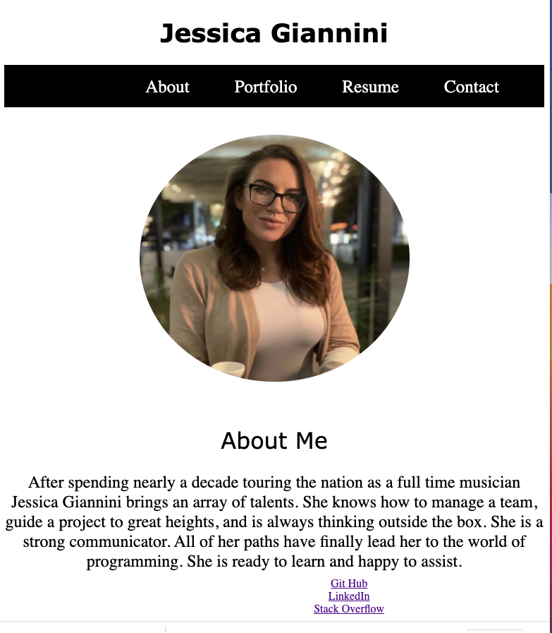

# React Web Portfolio

This project was bootstrapped with [Create React App](https://github.com/facebook/create-react-app).

Every great developer needs a place to showcase their work. This web portfolio is my first attempt at using React to build a front end website. 

## User Story
AS AN avid traveller
I WANT to be able to track my withdrawals and deposits with or without a data/internet connection
SO THAT my account balance is accurate when I am traveling

## Business Context

Giving users a fast and easy way to track their money is important, but allowing them to access that information anytime is even more important. Having offline functionality is paramount to our applications success.

## Built With

- [HTML](https://developer.mozilla.org/en-US/docs/Web/HTML)
- [CSS](https://developer.mozilla.org/en-US/docs/Web/CSS)
- [Javascript](https://developer.mozilla.org/en-US/docs/Web/JavaScript)
- [Express](https://expressjs.com/)
- [React](https://reactjs.org/)

## Deployed Link

- [See Live Site](https://jessgiannini.github.io/webPortfolioReact/))

## Available Scripts

In the project directory, you can run:

### `npm start`

Runs the app in the development mode.\
Open [http://localhost:3000](http://localhost:3000) to view it in the browser.

The page will reload if you make edits.\
You will also see any lint errors in the console.

### `npm run build`

Builds the app for production to the `build` folder.\
It correctly bundles React in production mode and optimizes the build for the best performance.

The build is minified and the filenames include the hashes.\
Your app is ready to be deployed!

See the section about [deployment](https://facebook.github.io/create-react-app/docs/deployment) for more information.

## Authors

**Jessica Giannini**

* [Link to Portfolio Site](https://github.com/JessGiannini/webPortfolioReact)
* [Link to Github](https://github.com/jessgiannini)
* [Link to LinkedIn](https://www.linkedin.com/in/jessica-giannini-155b1310/)

## Acknowledgments

- Thank you to my amazing classmates who help me navigate the ins and outs of coding.
- Thanks to all the YouTube stars who helped me see the many ways to pet a cat.
- Thanks to my friend Kelsey for inspiring me to take this course.